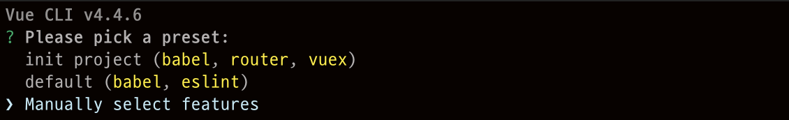
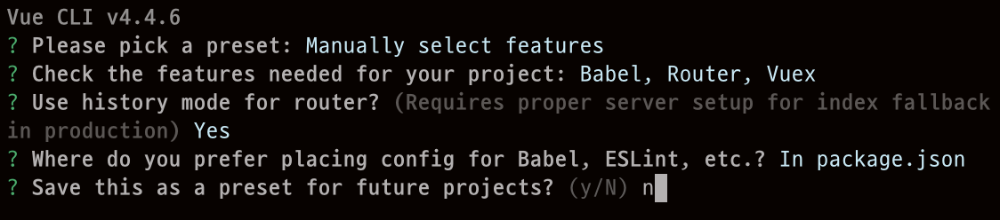

# easyVue
Vue 강의를 위한 소스입니다.
----------------------

## 기본 설치 (관리자 권한으로 실행해주세요.)
**node 설치**

`https://nodejs.org/en/download/`

설치 확인
> node --version

**Vue 설치**

> npm install -g @vue/cli

설치 확인

> vue --version

## Vue 시작

vue 프로젝트 생성

> vue create testproject

vue 실행하기

> cd $projectpath

> npm install

> npm run serve

## Plugin 추가

> vue add vuetify